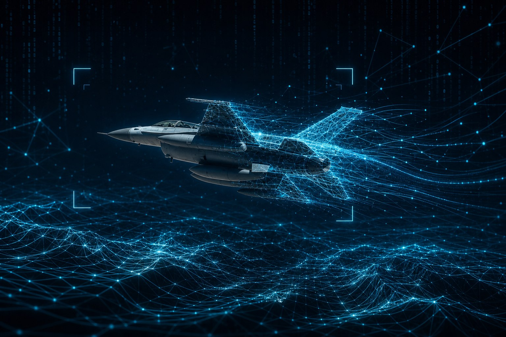

# DCSActualIntel



*AI shapes the scenario; Python and [pydcs](https://github.com/pydcs/dcs) build the `.miz`. Hero image derived from a public-domain U.S. Air Force photo (F-16 Block 70, 412th Test Wing, Edwards AFB).*

**Random and training missions for DCS World** — sized to the modules and maps you actually own.

Ask your AI agent for a SEAD sortie, a CAP station, or an F-16 HTS/HARM syllabus. You get briefing text, threats, and a flyable mission file in `Saved Games/DCS/Missions/`. The agent picks the story; `dcsintel` handles the mechanics so nobody has to hand-edit mission Lua.

The name is a joke on **DCS AI**: the agent provides the *actual intel* (situation, objective, threat picture). The builder side stays boring on purpose — same inputs, same seed, same file every time.

## What you can fly

| Type | Tasking | Red side (typical) |
|---|---|---|
| `dogfight` | BFM / merge | 1–8 fighters, head-on |
| `cap` | Combat air patrol | Strike package pushing your station |
| `sead` | Iron Hand / DEAD | SAM belt, EWR, optional CAP |
| `strike` | Precision attack | Defended supply dump |
| `escort` | Package escort | Interceptors on the bomber route |
| `cas` | Troops in contact | Armor plus mobile SHORAD |
| `intercept` | QRA scramble | Raid already inbound |

Random missions also take a **threat tier** (`training` through `high_threat`) and optional **scenario twists** (night, bandits already up, thin support, and similar). F-16 **training** sorties use fixed syllabi — SEAD, JDAM, Maverick, CAS, CAP, escort — with the same procedures every time but a new layout per seed.

## How it fits together

```
You  →  AI agent (dcs-mission-generator skill)
         detect modules → read doctrine → write MissionSpec JSON
      →  dcsintel generate | training
      →  .miz in Saved Games/DCS/Missions/
```

**MissionSpec** is the contract: a JSON blob where only `"type"` is required for random play. Training uses `curriculum` plus `difficulty`. The agent writes creative briefing fields; Python fills everything else from the seed.

## Get started

- **[Installation](docs/INSTALL.md)** — Python, `pip install`, agent skill, config without a local DCS install
- **[Usage](docs/USAGE.md)** — CLI commands, threat tiers, training curricula, MissionSpec reference, detection, troubleshooting

Quick path:

```bash
git clone https://github.com/SasquatchSecurity/DCSActualIntel.git
cd DCSActualIntel
pip install .
python scripts/install_skills.py
dcsintel detect
```

## Credits

Mission construction runs on **[pydcs](https://github.com/pydcs/dcs)** — the Python library the community uses to read and write DCS mission files. Thank you to the pydcs maintainers and contributors; this project would not work without their work. We depend on a pinned Git commit (not the broken PyPI 0.15.0 wheel on Python 3.13); see [Installation](docs/INSTALL.md#troubleshooting).

Eagle Dynamics owns DCS World. This project is not affiliated with ED or with the pydcs authors beyond being a downstream user.

## Contributing & license

Issues and PRs are welcome. Easiest wins: new entries in `src/dcsintel/data/modules.json` or `catalog.json`. See [Usage — extending the tool](docs/USAGE.md#extending-the-tool).

**Privacy:** committed files must not contain real profile paths, hostnames, or machine-specific install paths. Use placeholders like `C:/Users/you/...` in docs.

MIT — see [LICENSE](LICENSE).
